# Introduction

This repository aims to be a pipeline that uses Pytorch to train and inference deep learning model for medical imaging data. 

# Requirements

## Packages

* guildai
* torchio

## Third Party Packages

### Guild.ai

Guildai was selected as the pipeline manager of this repository. However, our reliance on guild is minimal. We use guild as an experiment manager, the Guild yml file was written to be general to a few applications including segmentation and classification. 

#### Install

To install guild.ai, use the following command:

```bash
pip install guildai
```

!! Please don't confuse it with the package `guild`. 

### Torchio

This repo uses mainly `torchio` as the IO, however, as `torchio` lacks certain function we require, we forked the repository and made some changes that are accustomed to our needs [here](https://github.com/alabamagan/torchio).

Alternative, you can install the forked package using this command:

```bash
pip install git+https://github.com/alabamagan/torchio
```

### MRI image normalization tools

This package uses the logger from MNTS. To 

To install:

```bash
pip install git+https://github.com/alabamagan/mri_normalization_tools
```


# Specification

`pmi` is implemented with 4 main units which interacts for training and inference: 

1. `main`
2. `pmi_data_loader`
3. `pmi_solver`
4. `pmi_inferencer`


## Model training

```mermaid
sequenceDiagram 
	Actor User
	User ->> main: Configurations
	main ->> pmi_data_loader: Data load config
    loop
        pmi_data_loader ->> pmi_data_loader: Load train data
        pmi_data_loader -->> pmi_data_loader: Load validation data
    end
    main ->> pmi_solver: TB plotter for visualization
    rect rgb(15, 55, 35) 
        loop
            pmi_data_loader ->>+ pmi_solver: tio.Queue
            pmi_solver ->> pmi_solver: Training epochs
            pmi_solver -->> pmi_solver: Validation
	        pmi_solver ->> main: Return data if requested
        end
	end
    pmi_solver ->>- main: Training finish, return learnt states
    main ->> User: Saved states



```




## Model inference

```mermaid
sequenceDiagram 
	Actor User
	User ->> main: Configurations
	main ->> pmi_data_loader: Data load config
    loop
        pmi_data_loader ->> pmi_data_loader: Load inference data
        pmi_data_loader -->> pmi_data_loader: Load target data

    end
  	main ->> pmi_inferencer: Trained state
    rect rgb(15, 55, 35) 
        loop
       		pmi_data_loader ->>+ pmi_inferencer: tio.Queue
            pmi_inferencer -->> pmi_inferencer: Inference
            pmi_inferencer ->> pmi_inferencer: Compute performance
            pmi_inferencer ->>- User: Write results to disc
        end
	end

```



