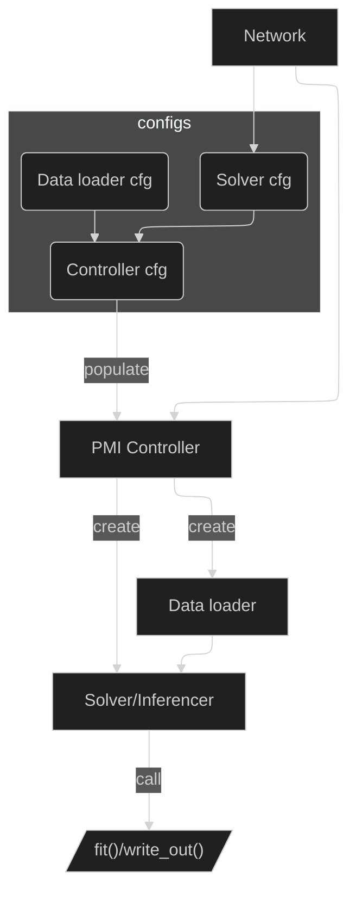

# Introduction

This repository aims to be a pipeline that uses Pytorch to train and inference deep learning model for medical imaging data.

# Installation

## TLDR;

Getting the source code:

```bash
git clone --recursive https://github.com/alabamagan/pytorch_medical_imaging
git clone https://github.com/alabamagan/mri_normalization_tools
```

Install custom repos that are pre-requisits:

```bash
pip install ./mri_normalization_tools
pip install pytorch_medical_imaging/ThirdParty/torchio # forked version refined for this package
pip install pytorch_medical_imaging/ThirdParty/surface-distance # for in-built system to evalute performance
```

Install the main package locally:

```bash
pip install pytorch_medical_imaging
```

## Third Party Packages (customized forks)

### Torchio

This repo uses mainly `torchio` as the IO, however, as `torchio` lacks certain function we require, we forked the repository and made some changes that are accustomed to our needs [here](https://github.com/alabamagan/torchio).

Alternative, you can install the forked package using this command:

```bash
pip install git+https://github.com/alabamagan/torchio
```

### MRI image normalization tools

This package uses the logger from MNTS, which is the normalization tool I wrote for convinience and reproducibility.

To install:

```bash
pip install git+https://github.com/alabamagan/mri_normalization_tools
```

# Specification

`pmi` is implemented with 4 main units which interacts for training and inference:

1. `main`
2. `pmi_data_loader`
3. `pmi_solver`
4. `pmi_inferencer`

## Model training

```mermaid
sequenceDiagram 
	Actor User
	User ->> main: Configurations
	main ->> pmi_data_loader: Data load config
    loop
        pmi_data_loader ->> pmi_data_loader: Load train data
        pmi_data_loader -->> pmi_data_loader: Load validation data
    end
    main ->> pmi_solver: TB plotter for visualization
    rect rgb(15, 55, 35) 
        loop
            pmi_data_loader ->>+ pmi_solver: tio.Queue
            pmi_solver ->> pmi_solver: Training epochs
            pmi_solver -->> pmi_solver: Validation
	        pmi_solver ->> main: Return data if requested
        end
	end
    pmi_solver ->>- main: Training finish, return learnt states
    main ->> User: Saved states



```



## Model inference

```mermaid
sequenceDiagram 
	Actor User
	User ->> main: Configurations
	main ->> pmi_data_loader: Data load config
    loop
        pmi_data_loader ->> pmi_data_loader: Load inference data
        pmi_data_loader -->> pmi_data_loader: Load target data

    end
  	main ->> pmi_inferencer: Trained state
    rect rgb(15, 55, 35) 
        loop
       		pmi_data_loader ->>+ pmi_inferencer: tio.Queue
            pmi_inferencer -->> pmi_inferencer: Inference
            pmi_inferencer ->> pmi_inferencer: Compute performance
            pmi_inferencer ->>- User: Write results to disc
        end
	end

```



## Call hierarchy



# CFG system

## Summary

In this package, the training and inference are both controlled using the CFG files. The CFG dictates how hyperparameters are passed into controller, solver and inferencers. It is basically defined as a python class (although an instance need to be created at some point), where the attribute of the instance serve as the messenger. 

## Using CFG within python

For each definition of solver/inferencer/controller, there's its default CFG class named `[SolverName]CFG`. The CFG file is defined to set the default attributes of the solver or inferencer. 

For example, if you wish to perform classification, you will typically use `ClassificationSolver`, or inherit this solver for your own finetunning.

## Using CFG with `guildai`

This package has also developed a system to train and inference with the help of experiement management package `guildai` (not to be confused with `guild` although most of its commands are based on `guild` as executable entry). You can use command line to define the hyperparameters you want for model training provided that you set up the flags correctly. From the [Call-hierarchy](#call-hierarchy) diagram, you see how the instance were created in sequential order behind the scene. However, in practice, you would typically create the `Controller` first, which will create the solver/inferencer. 

For example, if you wish to train a classificaiton network, you will typically use the `ClassificationSolver` and `ClassificationInferencer`. The syntax is as follow: 

```python
from pytorch_med_imaging.controller import PMIController, PMIControllerCFG
from pytorch_med_imaging.solvers import ClassificationSolver, ClassificationSolverCFG
# Note that solver and inferencer shares the same CFG instance
from pytorch_med_imaging.inferencers import ClassificationInferencer 

# Defined elsewhere
net = ...

# Create and customize the controller configurations
controller_cfg = PMIControllerCFG()
solver_cfg = ClassificationSolverCFG()

# Set how should the solver be created
controller_cfg.run_mode = 'train' # [train|inference]
controller_cfg.solver_cfg = solver_cfg
controller_cfg.solver_cls = ClassificationSolver
controller_cfg.inferencer_cls = ClassiicationInferencer

# Set the network into the solver
solver_cfg.net = net

# Chose the optimizer and configurations
solver_cfg.optimizer = 'Adam'
solver_cfg.lr_sche = 'ExponentialLR'
solver_cfg.batch_size = 12
solver_cfg.num_of_epochs = 50
solver_cfg.init_lr = 1E-5
... # More settings

# Start training
controller.exec()
```

### flags.yml

One way to pass define guild runs hyperparameters is through a yml file that will be read by guild. This file will be passed to `operations.[OpsName].flags-dest`, which means the flags defined in this file will be read and updated by guild and deposited into the run directory. We then read this deposited yml file and change the training setting by adding a file lines within `main.py`:

```python
yml_file = "/some/path/flags.yml"
cfg = ClassificationCFG()
controller = Controller(cfg)
controller.overrided_cfg(yml_file)
```

#### Structure

Typically, the attributes of the controller/solver can be access by defining a key-value pair in the yml file with the following syntax:

```yaml
solver_cfg:
  batch_size: 10
  optimizer: 'SGD'
  
data_loader_cfg:
  force_augment: False

controller_cfg:
  debug_mode: True
```

These attributes will be used to override the attributes of the solvers. 