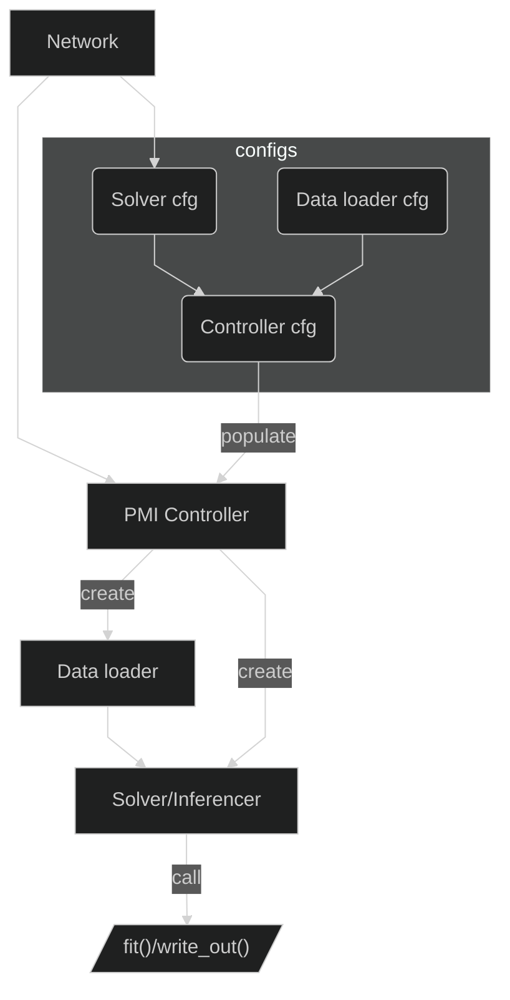

# Introduction

This repository aims to be a pipeline that uses Pytorch to train and inference deep learning model for medical imaging data.

# Installation

## TLDR;

Getting the source code:

```bash
git clone --recursive https://github.com/alabamagan/pytorch_medical_imaging
git clone https://github.com/alabamagan/mri_normalization_tools
```

Install custom repos that are pre-requisits:

```bash
pip install ./mri_normalization_tools
pip install pytorch_medical_imaging/ThirdParty/torchio # forked version refined for this package
pip install pytorch_medical_imaging/ThirdParty/surface-distance # for in-built system to evalute performance
```

Install the main package locally:

```bash
pip install pytorch_medical_imaging
```

## Third Party Packages (customized forks)

### Torchio

This repo uses mainly `torchio` as the IO, however, as `torchio` lacks certain function we require, we forked the repository and made some changes that are accustomed to our needs [here](https://github.com/alabamagan/torchio).

Alternative, you can install the forked package using this command:

```bash
pip install git+https://github.com/alabamagan/torchio
```

### MRI image normalization tools

This package uses the logger from MNTS, which is the normalization tool I wrote for convinience and reproducibility.

To install:

```bash
pip install git+https://github.com/alabamagan/mri_normalization_tools
```

# Specification

`pmi` is implemented with 4 main units which interacts for training and inference:

1. `main`
2. `pmi_data_loader`
3. `pmi_solver`
4. `pmi_inferencer`

## Model training

```mermaid
sequenceDiagram 
	Actor User
	User ->> main: Configurations
	main ->> pmi_data_loader: Data load config
    loop
        pmi_data_loader ->> pmi_data_loader: Load train data
        pmi_data_loader -->> pmi_data_loader: Load validation data
    end
    main ->> pmi_solver: TB plotter for visualization
    rect rgb(15, 55, 35) 
        loop
            pmi_data_loader ->>+ pmi_solver: tio.Queue
            pmi_solver ->> pmi_solver: Training epochs
            pmi_solver -->> pmi_solver: Validation
	        pmi_solver ->> main: Return data if requested
        end
	end
    pmi_solver ->>- main: Training finish, return learnt states
    main ->> User: Saved states



```



## Model inference

```mermaid
sequenceDiagram 
	Actor User
	User ->> main: Configurations
	main ->> pmi_data_loader: Data load config
    loop
        pmi_data_loader ->> pmi_data_loader: Load inference data
        pmi_data_loader -->> pmi_data_loader: Load target data

    end
  	main ->> pmi_inferencer: Trained state
    rect rgb(15, 55, 35) 
        loop
       		pmi_data_loader ->>+ pmi_inferencer: tio.Queue
            pmi_inferencer -->> pmi_inferencer: Inference
            pmi_inferencer ->> pmi_inferencer: Compute performance
            pmi_inferencer ->>- User: Write results to disc
        end
	end

```



## Call hierachy


