# Introduction

This repository aims to be a pipeline that uses pytorch to train and inference deep learning model for medical imaging data. 

# Requirements

## Packages

* 

## Third Party Packages

### Guild

Guild was selected as the pipeline manager of this repository. However, our reliance on guild is minimal. We use guild as an experiment manager, the Guild yml file was written to be general to a few applications including segmentation and classification. 

### Torchio

This repo uses mainly `torchio` as the IO, however, as `torchio` lacks certain function we require, we forked the repository and made some changes that are accustomed to our needs [here](https://github.com/alabamagan/torchio).

# Specification

`pmi` is implemented with 4 main units which interacts for training and inference: 

1. `main`
2. `pmi_data_loader`
3. `pmi_solver`
4. `pmi_inferencer`

```mermaid
sequenceDiagram 
	main ->> pmi_data_loader: tio.Queue
	alt Training mode
	  pmi_data_loader ->>+ pmi_solver: Load train data
	  rect rgb(15, 55, 35)
		loop
	  		pmi_solver ->> pmi_solver: Training epochs
	  		pmi_data_loader -->> pmi_solver: Load validation data
	  		pmi_solver -->> pmi_solver: Validation
  			pmi_solver ->> main: Return data if requested
  		end
  		end
    pmi_solver ->>- main: Training finish, return learnt states
	else Inference Mode
		pmi_data_loader ->> + pmi_inferencer: Load test data
	end


```

