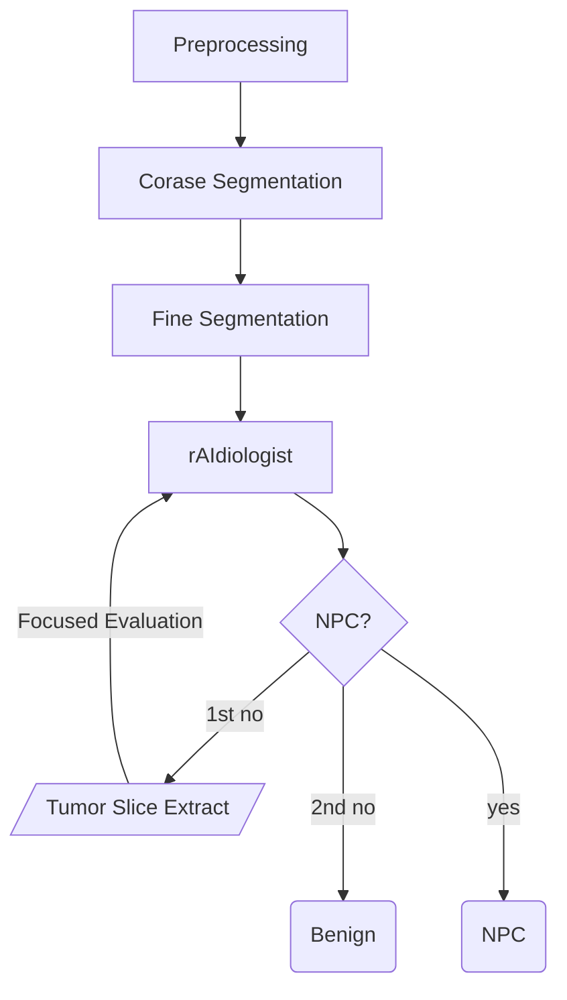

## File structure

```
.
├── asset/
│   ├── pmi_config/
│   │   ├── BM_nyul_v2.ini
│   │   └── NPC_seg.ini
│   ├── trained_states/
│   │   ├── deeplearning/
│   │   │   ├── segmen_checkpoint.pt
│   │   │   └── dl_diag_checkpoint.pt
│   │   └── radiomics/
│   │       └── (Nil)
│   ├── Logo.jpg
│   ├── t2w_normalization.yaml
│   ├── v1_seg_transform.yaml
│   └── v1_swran_transform.yaml
├── example_data/
│   ├── benign_case
│   ├── doubtful_case
│   ├── npc_case
│   └── ...
└── npc_report_gen/
    └── (Code directory)
```

## Pipeline for generating diagnosis



### Pre-processing module

Prior computation, the images need to be properly prepared. The pipeline will detect if an input is a directory or a single file. If a directory is supplied, it is assumed that the input is a DICOM directory, the program will try to locate the T2w-fs sequence, but if it fails, a prompt will ask the user which sequence should be used.

Afterwards, the program will decide if normalization is necessary. If so, Huang's method will be used to generate the tissue mask, and Nyul's normalization will be applied to the generated input.

A temp directory is created to hold all the outputs, including those from latter steps.

### Coarse segmentation

#### Input


| Description                   | Relative Path                                    |
| ------------------------------- | -------------------------------------------------- |
| Nyul normalized Images        | `[temp_path]/normalized_image/NyulNormalizer`    |
| Huang's threshold tissue mask | `[temp_path]/normalized_image/HuangThresholding` |

#### Output


| Description         | Relative Path                |
| --------------------- | ------------------------------ |
| Coarse segmentation | `[temp_path]/segment_output` |

This step uses the `PosLocTexHist` segmentation scheme to perform the segmentation roughly. As the scheme is patch-based, this step serve as a step to locate roughly where the nasopharynx thickening were, which will then be used as a reference for patch extraction during later fine segmentation.

The output coarse segmentation is also processed using the `grow_segmentation` function, which is essentially a binary dilation.

### Fine segmentation

#### Input


| Description              | Relative Path                                 |
| -------------------------- | ----------------------------------------------- |
| Nyul normalized Images   | `[temp_path]/normalized_image/NyulNormalizer` |
| Coarse segmentation mask | `[temp_path]/segment_output`                  |

#### Output


| Description       | Relative Path                |
| ------------------- | ------------------------------ |
| Fine segmentation | `[temp_path]/segment_output` |

In this step, the coarse segmentation is used a reference for patch extraction such that there will be a much higher chance of capturing a part of the tumor or benign lesion in the extracted patch. This produces a fine segmentation which is then post-processed.

The post-process of the fine segmentation is recorded in `seg_post_main()` function and the steps in `post_proc_segment.py`.

## Output file structure

## Possible outputs

### NPC

* DL score >= threshold
* Radiomics score >= threshold
* Total volume >= 0.5 cm^3

### Benign hyperplasia or normal

* DL score < threshold
* Radiomics score < threshold
* Total volume >= 3 cm ^3

### Normal

* DL score < threshold (Radiomics skipped because no lesion)
* Total volume < 0.5 cm^3

### Indeterminate

* Otherwise

## Note

* There should be no 'space bar' in all the directories
