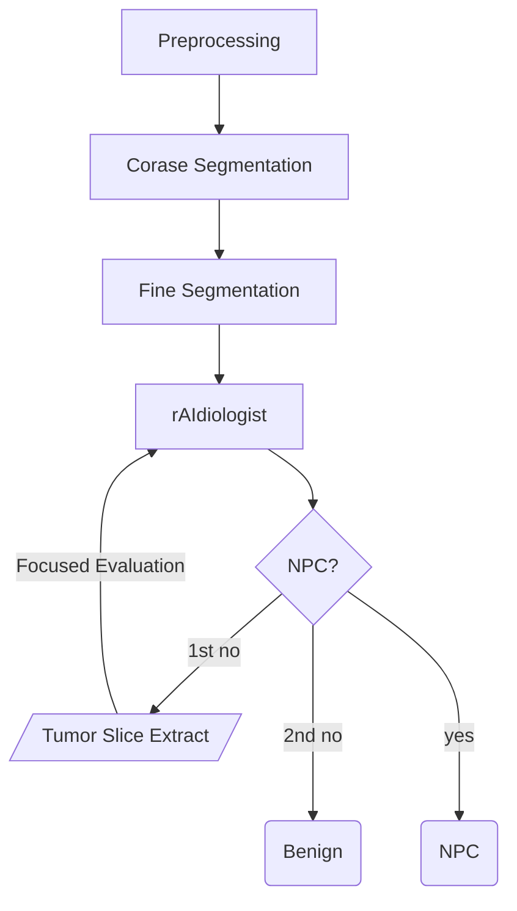

## Required 

* [pytorch_medical_imaging](url: https://github.com/alabamagan/pytorch_medical_imaging)
* [torchio](url:https://github.com/alabamagan/torchio) - custom build
* [mri_normalization_tools](url:https://github.com/alabamagan/mri_normalization_tools/tree/v0.2.0) - v0.2.0

## Usage

### Batch processing

For generating reports for a batch of data, only nifty format is supported. Place all the nifty file in the same directory with a naming system such that a unique ID can be globbed from their file names using a regex pattern. Run the following command:

```bash
report_gen --input INPUT --output OUTPUT -n NUM_WORKER --dump-diagnosis OUTPUT_CSV --idGlobber ID_GLOBBER [--idlist IDLIST|--verbose|--keep-data|---keep-log|--skip-exist]
```

### Single subject

For a single subject, it is possible to process a DICOM directory. The program will try to find suitable Axial T2-weighted fat-suppressed sequence, but in case it can't find any, it will prompt for user input. 

## File structure

```
.
├── asset/
│   ├── pmi_config/
│   │   ├── BM_nyul_v2.ini
│   │   └── NPC_seg.ini
│   ├── trained_states/
│   │   ├── deeplearning/
│   │   │   ├── segmen_checkpoint.pt
│   │   │   └── dl_diag_checkpoint.pt
│   │   └── radiomics/
│   │       └── (Nil)
│   ├── Logo.jpg
│   ├── t2w_normalization.yaml
│   ├── v1_seg_transform.yaml
│   └── v1_swran_transform.yaml
├── example_data/
│   ├── benign_case
│   ├── doubtful_case
│   ├── npc_case
│   └── ...
└── npc_report_gen/
    └── (Code directory)
```

## Pipeline for generating diagnosis



### Pre-processing module

Prior computation, the images need to be properly prepared. The pipeline will detect if an input is a directory or a single file. If a directory is supplied, it is assumed that the input is a DICOM directory, the program will try to locate the T2w-fs sequence, but if it fails, a prompt will ask the user which sequence should be used.

Afterwards, the program will decide if normalization is necessary. If so, Huang's method will be used to generate the tissue mask, and Nyul's normalization will be applied to the generated input.

A temp directory is created to hold all the outputs, including those from latter steps.

### Coarse segmentation

#### Input


| Description                   | Relative Path                                    |
| ------------------------------- | -------------------------------------------------- |
| Nyul normalized Images        | `[temp_path]/normalized_image/NyulNormalizer`    |
| Huang's threshold tissue mask | `[temp_path]/normalized_image/HuangThresholding` |

#### Output


| Description         | Relative Path                |
| --------------------- | ------------------------------ |
| Coarse segmentation | `[temp_path]/segment_output` |

This step uses the `PosLocTexHist` segmentation scheme to perform the segmentation roughly. As the scheme is patch-based, this step serve as a step to locate roughly where the nasopharynx thickening were, which will then be used as a reference for patch extraction during later fine segmentation.

The output coarse segmentation is also processed using the `grow_segmentation` function, which is essentially a binary dilation.

### Fine segmentation

#### Input


| Description              | Relative Path                                 |
| -------------------------- | ----------------------------------------------- |
| Nyul normalized Images   | `[temp_path]/normalized_image/NyulNormalizer` |
| Coarse segmentation mask | `[temp_path]/segment_output`                  |

#### Output


| Description       | Relative Path                |
| ------------------- | ------------------------------ |
| Fine segmentation | `[temp_path]/segment_output` |

In this step, the coarse segmentation is used a reference for patch extraction such that there will be a much higher chance of capturing a part of the tumor or benign lesion in the extracted patch. This produces a fine segmentation which is then post-processed.

The post-process of the fine segmentation is recorded in `seg_post_main()` function and the steps in `post_proc_segment.py`.

### rAIdiologist

#### Input

| Description            | Relative Path                                 |
| ---------------------- | --------------------------------------------- |
| Nyul normalized Images | `[temp_path]/normalized_image/NyulNormalizer` |
| Lesion mask            | `[temp_path]/segment_output`                  |

#### Output


| Description | Relative Path                        |
| ----------- | ------------------------------------ |
| Diagnosis   | `[temp_path]/dl_diag/class_inf.csv`  |
| Risk curve  | `[temp_path]/dl_diag/class_inf.json` |

In this step, the lesion mask is used as a reference for `CropOrPad` transformer in `torchio`, the center of cropping/padding is aligned with the center of the lesion segmentation. The diagnosis with column header `Prob_Class_0` is the predicted probability for NPC positive, which was trained using sigmoid as the output layer and 0.5 as the natural cut-off. The risk curve JSON file contains the changes of predicted risk when the AI scans across the slices. It is read as a dictionary with study number (ID) as its key, and the data were numpy arrays of dimension.

### Focal evaluation by rAIdiologist

#### Input

| Description            | Relative Path                                 |
| ---------------------- | --------------------------------------------- |
| Nyul normalized Images | `[temp_path]/normalized_image/NyulNormalizer` |
| Lesion mask            | `[temp_path]/segment_output`                  |

#### Output


| Description | Relative Path                                   |
| ----------- | ----------------------------------------------- |
| Diagnosis   | `[temp_path]/safety_net/dl_diag/class_inf.csv`  |
| Risk curve  | `[temp_path]/safety_net/dl_diag/class_inf.json` |

Input and outputs formats are the same except outputs are placed under `safety_net` in the temporary directory. This focal evaluate crops the input images to only containing the slices with segmentation ± 2 slices above and below the edge of the segmentation. Also, only those that are diagnosed as benign under go this step. 

The purpose of this step is for it to serve as a safety net and improve the sensitivity for small tumors. 

## FQA

### Q1. Why does the program finds nothing under the input directory?

Check your `--idGlobber` setting and make sure the regex provided has a valid match on at least one file within the input directory.

