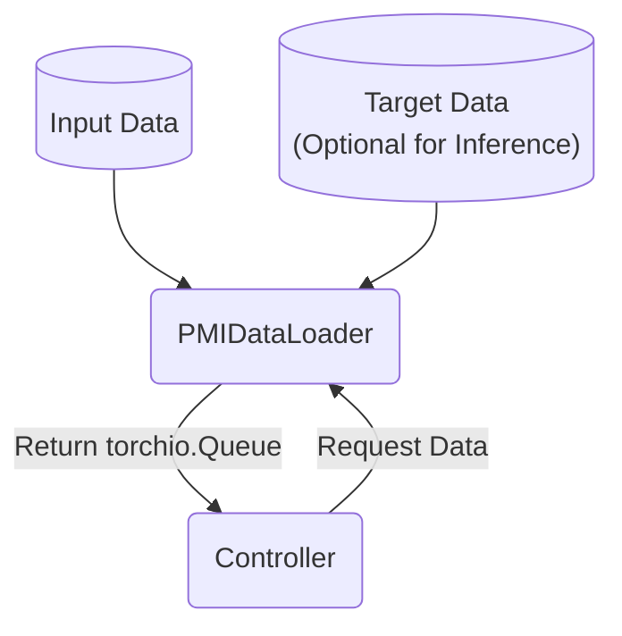
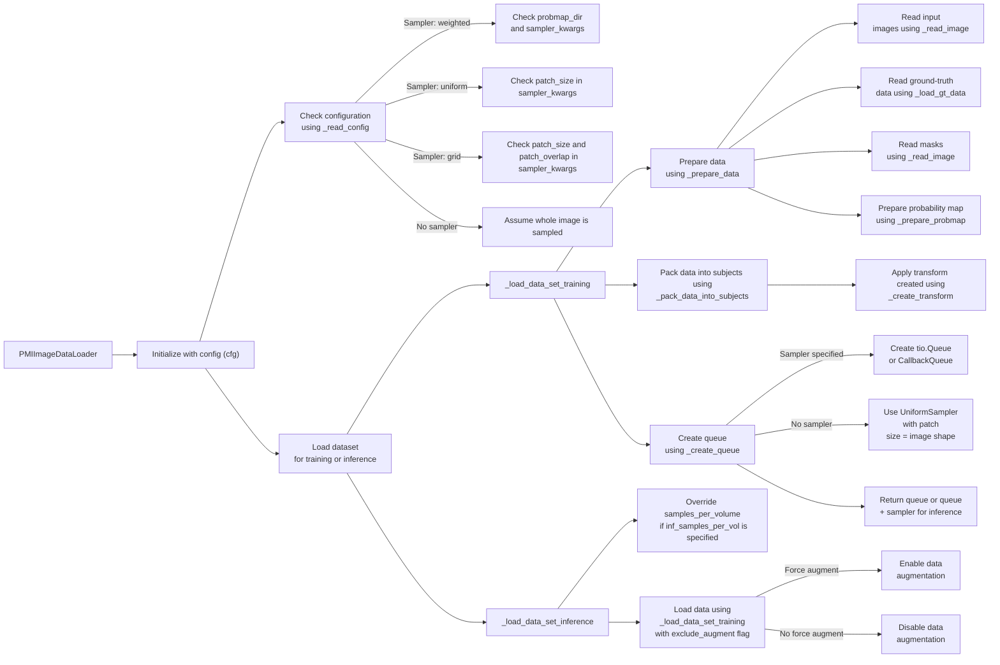

# General Loader Principle

Loaders are instances that handles data batching from input datasets to construct a dictionary based on `torchio`. All dataloaders should have a full definition for training and inference dataloading machanisms.

In essence, the loader is the API to request a `torchio.Queue` that will be used by the `Solver` or `Inferencer`.  Different situation calls for different prepration workflow.

# Examples

## PMIImageDataLoader

This loader is the typical loader you will use for img2img task. The loading mechanism requires an `ImageDataSet` input and another `ImageDataSet` target.

The key reason is because images are often of different raw sizes, and theres a need to extract patches from these images. Therefore, there's a `sampler` parameter in this loader that is not anticipated in other kind of non-imaging loaders.

